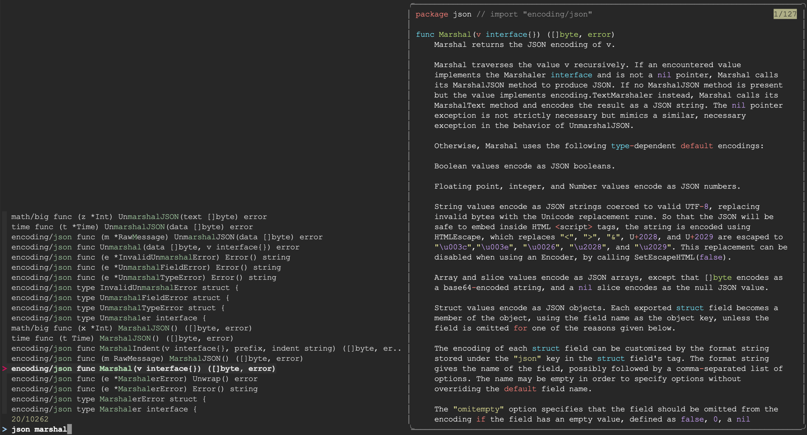

# gofzdoc
Use [fzf](https://github.com/junegunn/fzf) to fuzzy search go documentation.



## Features
* Search docs for standard library
* Search docs for third-party libraries (using `go.mod` of current directory)
* Preview as you search
* Open doc in browser by pressing `Ctrl-x`

## Prerequisites
To use `gofzdoc`, you need:

* bash
* [fzf](https://github.com/junegunn/fzf)
* [bat](https://github.com/sharkdp/bat) (optional) if you want syntax 
  highlighting

## Installation
### With Homebrew
```
brew tap dsabsay/homebrew-tap
brew install gofzdoc
```

### Without Homebrew
Download [gofzdoc](./gofzdoc) and place it somewhere on your PATH.

## Usage
```
Usage: gofzdoc [-h | --help] [-v | --version]

Environment variables:
    GOFZDOC_ENABLE_PREVIEW_WRAP
        Set to "1" to enable line wrapping in the preview window.
        This doesn't work well for some docs so it's disabled by
        default.
    GOFZDOC_ENABLE_PREVIEW_BAT
        Enable syntax highlighting using bat
        (https://github.com/sharkdp/bat).
    GOFZDOC_OPEN_BROWSER_URL
        Which base URL to open with Ctrl-x. Default is https://godoc.org/

Sub-commands:
    clear-cache - clear the index cache
```
## Acknowledgements
`gofzdoc` is a simple wrapper around `fzf` providing logic to generate and 
manage "indexes" that are fed into fzf. I'm extremely grateful to the hard work 
of [Junegunn Choi](https://github.com/junegunn), the author of `fzf`. It is a 
fantastic tool.
